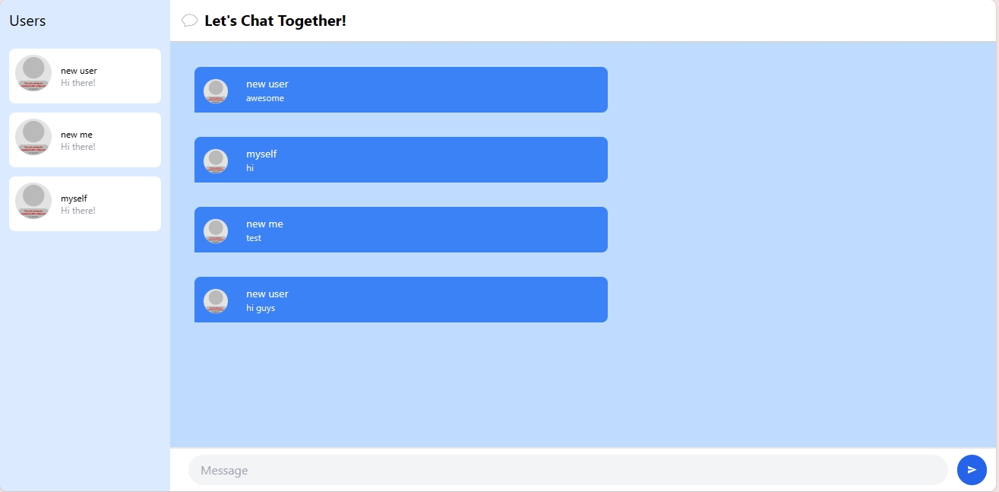

### 3.1 Original Code Result

Foto di atas adalah hasil program yang dieksekusi setelah saya melakukan clone dari https://github.com/jtordgeman/SimpleWebsocketServer dan https://github.com/jtordgeman/YewChat/tree/websockets-part2.

### 3.2 Explanation

Foto di atas adalah hasil programnya setelah saya mencoba untuk mengubah warna-warna pada programnya. Saya mengubah warna pada bagian div dari gray menjadi blue dan ada juga yang diubah angkanya untuk mengatur seberapa vibrant warnanya. Selain itu, ada juga warna teks yang saya ubah menjadi putih untuk menyesuaikan dengan background berwarna biru. Terakhir, saya mengubah title yang ada di atas agar lebih terdengar menarik.